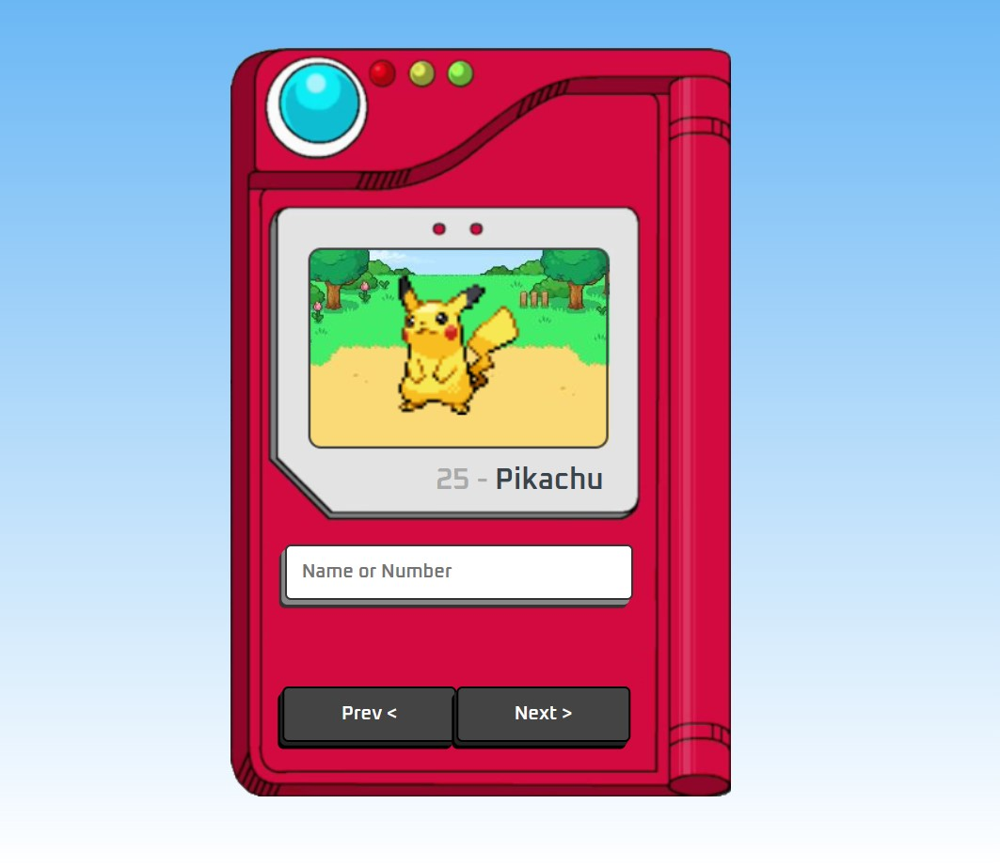

<h1 align="center">Pokedex JS</h1>

  

 

   
  
  
  
  

<a href="https://pokedex-js-zeta.vercel.app/" align="center">Project link</a> 

<ul>Content
  <li><a href="#overview">Overview</a> 
    <ul><li><a href="#the-project">The Project</a></li></ul>
  </li>  
  <li><a href="#the-process">The Process</a>
    <ul><li><a href="#lessons-learned">Lessons learned</a></li></ul>
  </li>  
  <li><a href="#authors">Authors</li>
</ul>

<h2 id="overview">Overview</h2>

<h3 id="the-project">The Project</h3>

Pokedex developed using HTML, CSS, Javascript and PokeAPI</a>.
 

The learning objectives for this project will be updated in the "Lessons learned" section as they are worked through in the run.

<h2 id="the-process">The Process</h2>

<h3 id="lessons-learned">Lessons learned</h3>
<ul>The learning acquired during the execution of this project will be constantly updated here:
  <li>API integration</li>
  <li>Next and Prev buttons working</li>
  <li>Searching by ID and name to find pokemons</li>
</ul> 

<h2 id="authors" align="left">Authors</h2>

<a href="https://github.com/amandafd">Amanda Dionisio</a>
<h3 align="left">You can fin me on social media:</h3>

  
  
  

